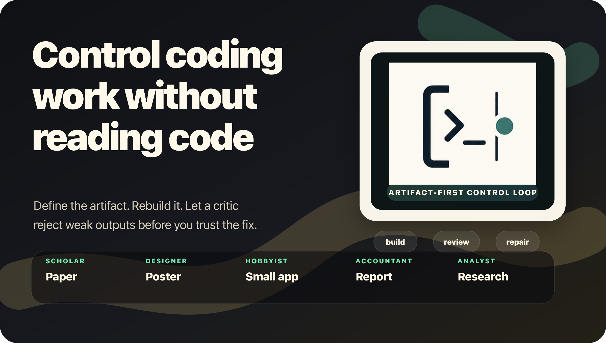
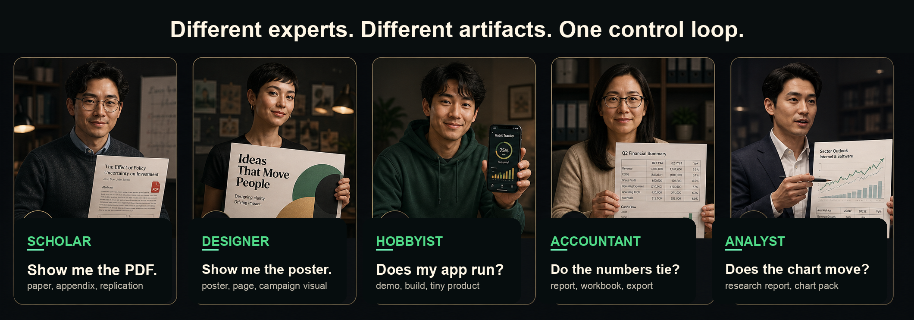
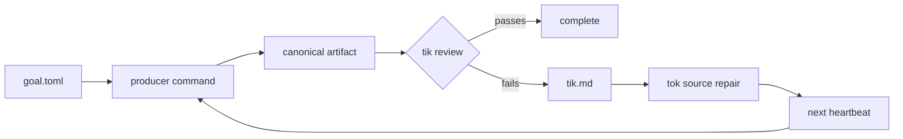

<!-- markdownlint-disable MD013 MD033 MD041 -->

<p align="center">
  
</p>

<h1 align="center">goal-cli</h1>

<p align="center">
  <strong>Artifact-first control for coding agents.</strong><br />
  Define the artifact, rebuild it, let <code>tik</code> judge it, then let <code>tok</code> repair source inside bounded scopes.
</p>

<p align="center">
  <a href="#quick-start"><strong>Start</strong></a>
  &nbsp;/&nbsp;
  <a href="#choose-the-artifact">Artifact</a>
  &nbsp;/&nbsp;
  <a href="#see-the-loop">Loop</a>
  &nbsp;/&nbsp;
  <a href="#configure-goaltoml">Config</a>
  &nbsp;/&nbsp;
  <a href="#command-deck">Commands</a>
  &nbsp;/&nbsp;
  <a href="#agent-skills">Skills</a>
</p>

<p align="center">
  <kbd>Python 3.11+</kbd>
  <kbd>artifact-first</kbd>
  <kbd>local-first</kbd>
  <kbd>single heartbeat</kbd>
</p>

`goal-cli` is for people who can judge the finished product but do not want to
audit every code diff. Each heartbeat rebuilds the canonical artifact,
critiques that artifact, repairs only configured source surfaces, and records
the next proof step.

<p align="center">
  <sub><strong>Project signals</strong></sub><br />
  
  
  
  
</p>

## Quick Start

Install from this checkout:

```bash
python3 -m venv .venv
source .venv/bin/activate
python3 -m pip install --upgrade pip
python3 -m pip install -e .
```

Create a goal, validate the setup, and run one heartbeat:

```bash
goal-cli init
$EDITOR goal.toml
goal-cli validate
goal-cli doctor
goal-cli run
goal-cli state
```

| Step | Command | Result |
| --- | --- | --- |
| Install | `python3 -m pip install -e .` | The CLI runs from this checkout. |
| Draft | `goal-cli init` | A starter `goal.toml` appears. |
| Check | `goal-cli validate` and `goal-cli doctor` | Paths, scopes, and providers are checked before execution. |
| Run | `goal-cli run` | One rebuild-review-repair heartbeat is recorded. |

<details>
  <summary><strong>Optional critique</strong></summary>

Install the OpenAI extra when `tik` should critique artifacts through the
Responses API:

```bash
python3 -m pip install -e '.[openai]'
export OPENAI_API_KEY="..."
goal-cli doctor
```

Use `goal-cli doctor --smoke-codex-goal` when setup should prove the internal
Codex `/goal` tok path. If `tik` uses `codex_file`, add
`--smoke-codex-file-tik` so doctor also proves Codex can review a temporary
single-file artifact copy and return a parseable tik verdict.

Use `--skip-openai-auth` only when auth is supplied outside the environment.
</details>

## Agent Skills

For non-expert setup, give your coding agent the root
[`llms.txt`](llms.txt) prompt or the
[`goal-cli-project-setup`](skills/goal-cli-project-setup/SKILL.md) skill. That
skill tells the agent how to discover the canonical artifact, synthesize a
stable producer command, write `goal.toml`, protect generated outputs, and run
the safe validation checks before the first real heartbeat.

Maintainers who add reusable recipes, tik oracle scripts, or project-family
examples should use
[`goal-cli-template-author`](skills/goal-cli-template-author/SKILL.md).

See [goal-cli Skills](docs/skills.md) for copy-paste agent instructions and
installation notes.

## Choose the Artifact

<p align="center">
  
</p>

The control point is always a product-shaped file or demo a domain expert can
inspect directly.

The right artifact is the thing you already know how to reject. `goal-cli`
does not ask you to become a code reviewer. It asks you to name the output that
must be rebuilt before any source repair gets credit.

| Question you can answer | Artifact to judge |
| --- | --- |
| "Show me the PDF." | Paper, appendix, slide deck, replication packet. |
| "Show me the poster." | Poster, landing page, campaign visual, export folder. |
| "Does my app run?" | Local demo, built site, packaged app, smoke-test report. |
| "Do the numbers tie?" | Workbook, reconciliation export, financial report. |
| "Does the chart move?" | Research report, chart pack, sector note, source-backed memo. |

## See the Loop

A heartbeat is a single-owner pass through the system. `tok` can edit sources,
but it cannot declare victory. Only a later rebuilt artifact can pass.



| Runtime action | Boundary |
| --- | --- |
| Load state and acquire a lock | A heartbeat has one owner. |
| Run the producer command | The artifact must exist before critique. |
| Run `tik` against the artifact | The critic sees the product, not the source diff. |
| Launch `tok` only on failure | Repair stays inside configured writable scopes. |
| Record state and exit | Liveness is explicit and recoverable. |

## Why It Exists

`goal-cli` replaces chat-level confidence with artifact proof you can inspect.

| Failure mode | Control handle |
| --- | --- |
| The chat claims the app is fixed. | The site, report, PDF, or build artifact is regenerated before success can pass. |
| You cannot audit the diff. | Judge the artifact: paper, poster, report, dataset, or app. |
| The chat got too long to trust. | State, prompts, reports, locks, and traces live under `.goal/`. |
| The repair pass declares success. | `tok` only repairs source. Completion belongs to artifact review. |
| Final proof is unclear. | `tik` reviews the rebuilt artifact, not the agent explanation. |

You decide the artifact, the review standard, and the writable source surface.
`goal-cli` enforces the heartbeat and records the evidence.

## Configure goal.toml

`goal.toml` is the brief for the control loop. It says what output matters, how
to rebuild it, who judges it, and where repairs are allowed.

| Control decision | Config field |
| --- | --- |
| Artifact to inspect | `[artifact].path` |
| Rebuild command | `[producer].command` |
| Artifact critic | `[tik]` |
| Source repair pass | `[tok]` |
| Git checkpoint and quality gate | `[no_mistakes]` |
| Telemetry export | `[observability]` |
| Generated folders and write scopes | `[safety]` |

```toml
name = "paper-ready"
state_dir = ".goal"
runs_dir = ".goal/runs"

[artifact]
path = "output/full_paper.pdf"
copy_as = "full_paper.pdf"

[producer]
command = "make all"

[tik]
provider = "oracle"
command = "python3 scripts/tik.py"

[tok]
provider = "codex_goal"
write_dirs = ["writing", "src"]
sandbox = "workspace-write"
codex_features = ["goals"]

[safety]
generated_dirs = ["output", "build"]
max_blocker_repeats = 3
```

For a PDF-first research workflow:

```bash
cp examples/scientificity/goal.toml ./goal.toml
```

Then edit artifact paths, write scopes, tik provider settings, and the
producer command for that repository.

## Runtime Contract

| Role | Job | Hard boundary |
| --- | --- | --- |
| Producer | Rebuild the artifact from source. | Must create `[artifact].path`. |
| Tik | Critique the artifact. | Sees the product and writes `tik.md`. |
| Tok | Repair source files. | Edits only configured `write_dirs`. |
| Heartbeat | Own liveness and state. | Runs once, records, exits. |
| Git gate | Protect transitions. | Default no-mistakes checkpoint and review when enabled. |

Public `tik` modes:

- `oracle`: deterministic scripts, tests, metrics, or machine checks.
- `agent`: OpenAI Responses API file-upload artifact critique.
- `codex_file`: Codex critique of a local artifact copy in a read-only
  single-file workspace with ephemeral session state.

Production `tok` mode:

- `codex_goal`: launches an internal Codex `/goal` with a JSON Schema-checked
  final report.

Runtime state stays in `.goal/state.json`. Common terminal or blocked outcomes
include `complete`, `blocked_producer_failed`, `blocked_artifact_missing`,
`blocked_tik_failed`, `blocked_unparseable_tik`, `blocked_stale_tik_review`,
`blocked_tok_failed`, `blocked_no_source_change_possible`,
`blocked_repeated_same_objection`, `blocked_no_mistakes_failed`, and
`budget_limited`.

## Command Deck

| Command | Role in the loop |
| --- | --- |
| `goal-cli` | Defaults to `goal-cli run`. |
| `goal-cli -c path/to/goal.toml ...` | Use a non-default config path. |
| `goal-cli init` | Create a starter `goal.toml`. |
| `goal-cli validate` | Check config, prompt placeholders, artifact paths, and writable scopes. |
| `goal-cli doctor` | Check setup readiness; add smoke flags to prove Codex tok and `codex_file` tik. |
| `goal-cli run --max-minutes 30` | Execute one autonomous heartbeat with a wall-clock budget. |
| `goal-cli run --dry-run` | Create a run directory and render prompts without provider calls. |
| `goal-cli tik` | Run producer plus tik review, but skip completion and tok repair. |
| `goal-cli render-prompts` | Write rendered tik and tok prompts into a run directory. |
| `goal-cli state` | Print `.goal/state.json` or the default initial state. |
| `goal-cli cleanup` | Remove dead heartbeat locks and mark interrupted running phases. |
| `goal-cli cleanup --kill-orphans` | Also terminate orphan goal-cli/Codex processes for this project when no live lock exists. |
| `goal-cli reset` | Remove state and stale locks while preserving run artifacts. |

See [CLI reference](docs/cli-reference.md) for the current `-h` surfaces.

<details>
  <summary><strong>Observability</strong></summary>

OpenTelemetry tracing records heartbeat liveness, artifact loading, critique,
repair, and gate decisions.

Default endpoint:

```toml
[observability]
service_name = "goal-cli"
endpoint = "http://localhost:4318/v1/traces"
timeout_seconds = 5
```

If no configured OTLP receiver is reachable and no OTLP endpoint was explicitly
set through the environment, `goal-cli` writes local fallback traces to:

```text
.goal/observability/traces.jsonl
```

For collector-managed local traces:

```bash
mkdir -p .goal/observability
cp docs/otel-collector-file.yaml .goal/observability/otel-collector.yaml
docker run --rm --name goal-cli-otel \
  -p 4318:4318 \
  -v "$PWD/.goal/observability:/observability" \
  -v "$PWD/.goal/observability/otel-collector.yaml:/etc/otelcol-contrib/config.yaml:ro" \
  otel/opentelemetry-collector-contrib:latest \
  --config=/etc/otelcol-contrib/config.yaml
```

</details>

<details>
  <summary><strong>Git gate</strong></summary>

The Git gate ties repair transitions to explicit checkpoints through
[`kunchenguid/no-mistakes`](https://github.com/kunchenguid/no-mistakes).

Default gate config:

```toml
[no_mistakes]
enabled = true
binary = "no-mistakes"
mode = "lightspeed"
branch_prefix = "goal-cli"
```

When enabled, non-dry-run heartbeats start from a clean Git worktree. If the
repo is on the default branch, `goal-cli` creates a `goal-cli/...` feature
branch. Runtime files under `.goal/` are excluded through `.git/info/exclude`.

`mode = "lightspeed"` uses no-mistakes with high-latency steps skipped. Use
`mode = "fast"` or `mode = "full"` when a branch needs stronger local or
release gates.
</details>

<details>
  <summary><strong>Internal shape</strong></summary>

The implementation keeps four seams narrow:

| Seam | Responsibility |
| --- | --- |
| Git Gate | `NoMistakesGate` owns clean checkpoints, feature branches, skip presets, readiness flags, and `no-mistakes axi run`. |
| Heartbeat State | `HeartbeatRecorder` owns state, history, heartbeat emission, transitions, and no-mistakes state recording. |
| Tok Execution | `tok_execution` owns Codex `/goal` command construction, JSON Schema validation, prompt files, reports, and diagnostics. |
| Readiness and Telemetry | `doctor` and runtime share tok execution and `TelemetryExportPlan`, so setup checks describe the real path. |

</details>

## Development

```bash
python3 -m pip install -e '.[openai]'
python3 -m pip install pytest
python3 -m pytest -q
goal-cli --help
```

## Further Docs

| Document | Purpose |
| --- | --- |
| [CLI reference](docs/cli-reference.md) | Current `goal-cli -h` and high-use subcommand help surfaces. |
| [Installing goal-cli](docs/installation.md) | Setup path and environment expectations. |
| [goal.toml schema](docs/config-schema.md) | Full configuration reference. |
| [goal-cli Skills](docs/skills.md) | Agent-facing setup skills and the one-click prompt. |
| [Artifact-centered design notes](docs/artifact-goal-notes.md) | Product model and runtime rationale. |
| [Codex goal implementation report](docs/codex-goal-openai-implementation-report.md) | Codex `/goal` tok implementation details. |
| [PDF-first example goal](examples/scientificity/goal.toml) | Example workflow for research artifacts. |
| [OpenTelemetry Collector file exporter config](docs/otel-collector-file.yaml) | Local collector setup. |

## Status

`goal-cli` is early local tooling, currently published as version `0.1.0`.
It is useful when you already know the artifact, producer command, evaluator,
and writable source surface.

No license file is included yet. Add one before accepting external
contributions or using this as a dependency in another public project.
