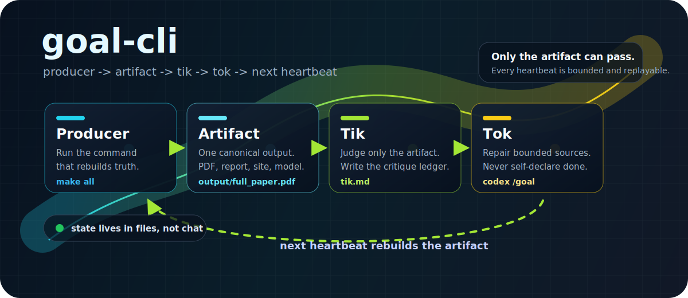
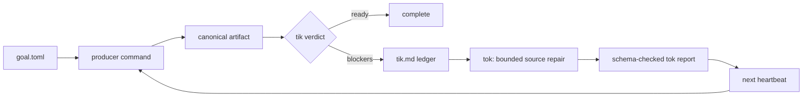

<div align="center">
  

  <h1>goal-cli</h1>

  <p><strong>Artifact-centered autonomy for projects where the final output is the only truth.</strong></p>

  <p>
    <a href="https://github.com/SiyaoZheng/goal-cli"></a>
    
    
    
    
  </p>

  <p>
    <a href="#quick-start">Quick Start</a>
    <span> . </span>
    <a href="#the-loop">The Loop</a>
    <span> . </span>
    <a href="#configuration">Configuration</a>
    <span> . </span>
    <a href="#command-deck">Commands</a>
    <span> . </span>
    <a href="#docs">Docs</a>
  </p>
</div>

---

`goal-cli` turns a big project objective into a repeatable heartbeat:
build the canonical artifact, critique only that artifact, make one bounded
source repair if the artifact fails, then exit with state ready for the next
heartbeat.

It is built for work where "done" cannot mean "the agent edited files." Done
means the product exists and passes its evaluator: a PDF, benchmark result,
report, site, dataset, model checkpoint, package, or another artifact that can
be rebuilt from source.

## Why It Exists

Autonomous project loops usually fail for boring reasons: the success target is
vague, the agent grades its own work, state lives in chat, generated outputs get
edited directly, or a long run loses track of the actual deliverable.

`goal-cli` makes those failure modes explicit:

| Problem | `goal-cli` answer |
| --- | --- |
| The target drifts | One canonical artifact is the success standard. |
| The agent judges itself | `tik` reviews the rebuilt artifact before any source repair. |
| The loop mutates random files | `tok.write_dirs` bounds what the repair pass may edit. |
| Progress is conversational | State, heartbeats, prompts, reports, and traces are written to `.goal/`. |
| A repair claims victory | Only a later producer plus passing `tik` can complete the goal. |
| Local quality gates get skipped | The optional no-mistakes gate checkpoints and reviews transitions. |

## Quick Start

Install from this checkout:

```bash
python3 -m venv .venv
source .venv/bin/activate
python3 -m pip install --upgrade pip
python3 -m pip install -e .
```

Create and check a goal:

```bash
goal-cli init
$EDITOR goal.toml
goal-cli validate
goal-cli doctor
```

Run one heartbeat:

```bash
goal-cli run
goal-cli state
```

For model-based `tik` reviews:

```bash
python3 -m pip install -e '.[openai]'
export OPENAI_API_KEY="..."
goal-cli doctor
```

Use `goal-cli doctor --skip-openai-auth` only when auth is intentionally supplied
outside the environment.

Use `goal-cli doctor --smoke-codex-goal` when setup should prove the internal
Codex `/goal` tok path too.

## The Loop



Each `goal-cli run` executes exactly one heartbeat:

1. Load file-backed state and acquire a lock.
2. Run the configured producer command.
3. Verify the canonical artifact exists.
4. Run `tik` against the artifact and write `tik.md`.
5. If `tik` passes, mark the goal complete.
6. If `tik` fails, launch one bounded `tok` source-repair pass.
7. Validate the tok JSON report, write state, and exit.

The important constraint is asymmetric: `tok` can improve sources, but `tok`
cannot complete the artifact-level goal. Completion belongs to a later rebuild
and a passing `tik`.

## Configuration

A goal is a single `goal.toml` file. The minimal shape is:

```toml
name = "paper-ready"
state_dir = ".goal"
runs_dir = ".goal/runs"

[artifact]
path = "output/full_paper.pdf"
copy_as = "full_paper.pdf"

[producer]
command = "make all"

[tik]
provider = "oracle"
command = "python3 scripts/tik.py"

[tok]
provider = "codex_goal"
write_dirs = ["writing", "src"]
sandbox = "workspace-write"
codex_features = ["goals"]

[safety]
generated_dirs = ["output", "build"]
max_blocker_repeats = 3
```

Start from the PDF-first example when the deliverable is a manuscript:

```bash
cp examples/scientificity/goal.toml ./goal.toml
```

Then edit the artifact path, producer command, writable scopes, and evaluator.

## Runtime Roles

| Role | Owns | Rule |
| --- | --- | --- |
| Producer | Rebuilds the artifact from source | It must create the canonical artifact path. |
| Tik | Artifact critique | It sees the artifact and writes `tik.md`. |
| Tok | Source repair | It receives the whole `tik.md` ledger and edits only allowed source dirs. |
| Heartbeat | Liveness and state | It performs one bounded cycle, records the result, and exits. |
| Gate | Git quality boundary | no-mistakes can checkpoint and review source transitions. |

Public `tik` modes:

- `oracle`: deterministic scripts, tests, metrics, or machine checks.
- `agent`: model-based artifact critique.

Production `tok` mode:

- `codex_goal`: launches an internal Codex `/goal` with a JSON Schema-checked
  final report.

## Command Deck

| Command | What it does |
| --- | --- |
| `goal-cli init` | Create a starter `goal.toml`. |
| `goal-cli validate` | Check config, artifact paths, and writable scopes. |
| `goal-cli doctor` | Check whether this goal can run end to end. |
| `goal-cli run` | Execute one autonomous heartbeat. |
| `goal-cli tik` | Run producer plus tik, but skip tok. |
| `goal-cli render-prompts` | Write rendered tik and tok prompts into a run directory. |
| `goal-cli state` | Print `.goal/state.json` or the default initial state. |
| `goal-cli reset` | Remove state and stale locks while preserving run artifacts. |

## Observability

OpenTelemetry tracing is on by default. Runtime spans cover the heartbeat,
producer, artifact load, tik, tok, and no-mistakes gate.

Default endpoint:

```toml
[observability]
service_name = "goal-cli"
endpoint = "http://localhost:4318/v1/traces"
timeout_seconds = 5
```

If no configured OTLP receiver is reachable and no OTLP endpoint was explicitly
set through the environment, `goal-cli` writes local fallback traces to:

```text
.goal/observability/traces.jsonl
```

For collector-managed local traces:

```bash
mkdir -p .goal/observability
cp docs/otel-collector-file.yaml .goal/observability/otel-collector.yaml
docker run --rm --name goal-cli-otel \
  -p 4318:4318 \
  -v "$PWD/.goal/observability:/observability" \
  -v "$PWD/.goal/observability/otel-collector.yaml:/etc/otelcol-contrib/config.yaml:ro" \
  otel/opentelemetry-collector-contrib:latest \
  --config=/etc/otelcol-contrib/config.yaml
```

## Git Gate

`goal-cli` can hand committed checkpoints to
[`kunchenguid/no-mistakes`](https://github.com/kunchenguid/no-mistakes).
The gate is enabled by default:

```toml
[no_mistakes]
enabled = true
binary = "no-mistakes"
mode = "lightspeed"
branch_prefix = "goal-cli"
```

When enabled, non-dry-run heartbeats start from a clean Git worktree. If the
repo is on the default branch, `goal-cli` creates a `goal-cli/...` feature
branch. Runtime files under `.goal/` are excluded through `.git/info/exclude`.

`mode = "lightspeed"` uses no-mistakes with high-latency steps skipped. Use
`mode = "fast"` or `mode = "full"` when a branch needs stronger local or release
gates.

## Internal Shape

The implementation keeps four module seams narrow:

| Seam | Responsibility |
| --- | --- |
| Git Gate | `NoMistakesGate` owns clean checkpoints, feature branches, skip presets, readiness flags, and `no-mistakes axi run`. |
| Heartbeat State | `HeartbeatRecorder` owns state, history, heartbeat emission, transitions, and no-mistakes state recording. |
| Tok Execution | `tok_execution` owns Codex `/goal` command construction, JSON Schema validation, prompt files, reports, and diagnostics. |
| Readiness and Telemetry | `doctor` and runtime share tok execution and `TelemetryExportPlan`, so setup checks describe the real path. |

## Development

```bash
python3 -m pip install -e '.[openai]'
python3 -m pytest -q
goal-cli --help
```

If `pytest` is not installed in your active environment, install it in the same
virtualenv used for development:

```bash
python3 -m pip install pytest
```

## Docs

- [Installing goal-cli](docs/installation.md)
- [goal.toml schema](docs/config-schema.md)
- [Artifact-centered design notes](docs/artifact-goal-notes.md)
- [Codex goal implementation report](docs/codex-goal-openai-implementation-report.md)
- [PDF-first example goal](examples/scientificity/goal.toml)
- [OpenTelemetry Collector file exporter config](docs/otel-collector-file.yaml)

## Status

`goal-cli` is early local tooling, currently published as version `0.1.0`.
It is useful when you already know the artifact, producer command, evaluator,
and writable source surface.

No license file is included yet. Add one before accepting external
contributions or using this as a dependency in another public project.
