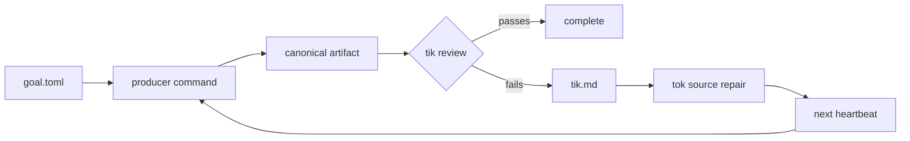

<p align="center">
  
</p>

<p align="center">
  <a href="#run-a-heartbeat"><strong>Run a heartbeat</strong></a>
  &nbsp;/&nbsp;
  <a href="#pick-your-artifact">Pick your artifact</a>
  &nbsp;/&nbsp;
  <a href="#see-the-loop">See the loop</a>
  &nbsp;/&nbsp;
  <a href="#configure-it">Configure it</a>
</p>

<p align="center">
  <kbd>Python 3.11+</kbd>
  <kbd>for non-coders</kbd>
  <kbd>artifact-first</kbd>
  <kbd>local-first</kbd>
</p>

<h2 align="center">If you can judge the output, you can control the coding work.</h2>

<p align="center">
  <code>goal-cli</code> is not an agent. It is an artifact-first control loop for people who use coding agents but judge the finished output.
</p>

## Pick Your Artifact

<p align="center">
  
</p>

The right artifact is the thing you already know how to reject. `goal-cli`
does not ask you to become a code reviewer. It asks you to name the output that
must be rebuilt before any source repair gets credit.

| If your real question is | Make this the artifact |
| --- | --- |
| "Show me the PDF." | Paper, appendix, slide deck, replication packet. |
| "Show me the poster." | Poster, landing page, campaign visual, export folder. |
| "Does my app run?" | Local demo, built site, packaged app, smoke-test report. |
| "Do the numbers tie?" | Workbook, reconciliation export, financial report. |
| "Does the chart move?" | Research report, chart pack, sector note, source-backed memo. |

## Run a Heartbeat

A heartbeat is one controlled pass through the system. Install the CLI, name
the artifact, validate the setup, then run exactly one rebuild-review-repair
cycle.

| Checkpoint | Command | You should know |
| --- | --- | --- |
| Install locally | `python3 -m pip install -e .` | The CLI runs from this checkout. |
| Create a goal | `goal-cli init` | You now have a starter `goal.toml`. |
| Validate the brief | `goal-cli validate` and `goal-cli doctor` | Paths, scopes, and providers are checked before the run. |
| Run one heartbeat | `goal-cli run` | The artifact is rebuilt before success can be recorded. |

```bash
python3 -m venv .venv
source .venv/bin/activate
python3 -m pip install --upgrade pip
python3 -m pip install -e .
```

Create, validate, and run a goal:

```bash
goal-cli init
$EDITOR goal.toml
goal-cli validate
goal-cli doctor
goal-cli run
goal-cli state
```

For model-based artifact critique:

```bash
python3 -m pip install -e '.[openai]'
export OPENAI_API_KEY="..."
goal-cli doctor
```

Use `goal-cli doctor --smoke-codex-goal` when setup should prove the internal
Codex `/goal` tok path too. If tik uses `codex_file`, add
`--smoke-codex-file-tik` so doctor also proves Codex can review a temporary
single-file artifact copy and return a parseable tik verdict. Use
`--skip-openai-auth` only when auth is supplied outside the environment.

## See the Loop

The loop is a standard of proof. The repair pass can edit sources, but it
cannot declare victory. Only a later rebuilt artifact can pass.



<table>
  <tr>
    <td width="25%" valign="top">
      <h3>Rebuild</h3>
      <p>The producer command creates the artifact first. Missing output is failure, not progress.</p>
    </td>
    <td width="25%" valign="top">
      <h3>Review</h3>
      <p><code>tik</code> critiques the artifact itself and writes the machine handoff.</p>
    </td>
    <td width="25%" valign="top">
      <h3>Repair</h3>
      <p><code>tok</code> reads <code>tik.md</code> and edits only the allowed source surface.</p>
    </td>
    <td width="25%" valign="top">
      <h3>Prove</h3>
      <p>The next heartbeat rebuilds the product and lets <code>tik</code> judge the new artifact.</p>
    </td>
  </tr>
</table>

The same loop in plain English:

| Runtime action | Boundary |
| --- | --- |
| Load file-backed state and acquire a lock | A heartbeat is single-owner. |
| Run the producer command | The artifact must exist before critique. |
| Run `tik` against the artifact | The critic sees the product, not the source diff. |
| Launch `tok` only on failure | Repair stays inside configured writable scopes. |
| Record state and exit | Liveness is explicit and recoverable. |

## Why It Exists

| When AI coding feels like magic | `goal-cli` gives you a handle |
| --- | --- |
| "The chat says it fixed the app." | The site or build artifact is regenerated before the goal can pass. |
| "I cannot audit the diff." | Judge the artifact: paper, poster, report, research report, dataset, or app. |
| "The chat got too long to trust." | State, prompts, reports, locks, and traces live under `.goal/`. |
| "The repair pass declared success." | `tok` can only change sources. Completion belongs to artifact review. |
| "I need a stronger final standard." | `tik` reviews the artifact after rebuild, not the agent's explanation. |

You stay in charge of the parts you can judge:

| You decide | `goal-cli` enforces |
| --- | --- |
| The artifact that counts | The producer must rebuild it before any success claim matters. |
| The review standard | `tik` critiques the artifact and writes `tik.md` for the repair pass. |
| The writable surface | `tok` repairs only the configured source directories. |
| The heartbeat | Every run records state, traces, reports, and the next action. |

## Configure It

Treat `goal.toml` as the brief you would give the control loop if you were being
precise. The file says what output matters, how to rebuild it, who judges it,
and where repairs are allowed.

| Decision | Plain-English meaning | Field |
| --- | --- | --- |
| Artifact | The thing you can inspect and reject. | `[artifact].path` |
| Producer | The command that rebuilds that thing. | `[producer].command` |
| Tik | The critic that reviews the rebuilt artifact. | `[tik]` |
| Tok | The source-repair pass that runs after artifact failure. | `[tok]` |
| Safety | Generated folders, write scopes, and blocker policy. | `[safety]` |

A goal is one `goal.toml` file:

```toml
name = "paper-ready"
state_dir = ".goal"
runs_dir = ".goal/runs"

[artifact]
path = "output/full_paper.pdf"
copy_as = "full_paper.pdf"

[producer]
command = "make all"

[tik]
provider = "oracle"
command = "python3 scripts/tik.py"

[tok]
provider = "codex_goal"
write_dirs = ["writing", "src"]
sandbox = "workspace-write"
codex_features = ["goals"]

[safety]
generated_dirs = ["output", "build"]
max_blocker_repeats = 3
```

For a PDF-first research workflow:

```bash
cp examples/scientificity/goal.toml ./goal.toml
```

Then edit artifact paths, write scopes, tik provider settings, and the producer
command for that repository.

## Runtime Roles

| Role | Job | Hard boundary |
| --- | --- | --- |
| Producer | Rebuild the artifact from source | Must create `[artifact].path`. |
| Tik | Critique the artifact | Sees the product, writes `tik.md`. |
| Tok | Repair source files | Edits only configured `write_dirs`. |
| Heartbeat | Own liveness and state | Runs once, records, exits. |
| Git gate | Protect transitions | Optional no-mistakes checkpoint and review. |

Public `tik` modes:

- `oracle`: deterministic scripts, tests, metrics, or machine checks.
- `agent`: OpenAI Responses API file-upload artifact critique.
- `codex_file`: Codex critique of a local artifact copy in a read-only
  single-file workspace.

Production `tok` mode:

- `codex_goal`: launches an internal Codex `/goal` with a JSON Schema-checked
  final report.

## Command Deck

| Command | What it does |
| --- | --- |
| `goal-cli init` | Create a starter `goal.toml`. |
| `goal-cli validate` | Check config, artifact paths, and writable scopes. |
| `goal-cli doctor` | Check whether this goal can run end to end. |
| `goal-cli run` | Execute one autonomous heartbeat. |
| `goal-cli tik` | Run producer plus tik, but skip tok. |
| `goal-cli render-prompts` | Write rendered tik and tok prompts into a run directory. |
| `goal-cli state` | Print `.goal/state.json` or the default initial state. |
| `goal-cli reset` | Remove state and stale locks while preserving run artifacts. |

<details>
  <summary><strong>Observability</strong></summary>

OpenTelemetry tracing is enabled by default. Runtime spans cover the heartbeat,
producer, artifact load, tik, tok, and no-mistakes gate.

Default endpoint:

```toml
[observability]
service_name = "goal-cli"
endpoint = "http://localhost:4318/v1/traces"
timeout_seconds = 5
```

If no configured OTLP receiver is reachable and no OTLP endpoint was explicitly
set through the environment, `goal-cli` writes local fallback traces to:

```text
.goal/observability/traces.jsonl
```

For collector-managed local traces:

```bash
mkdir -p .goal/observability
cp docs/otel-collector-file.yaml .goal/observability/otel-collector.yaml
docker run --rm --name goal-cli-otel \
  -p 4318:4318 \
  -v "$PWD/.goal/observability:/observability" \
  -v "$PWD/.goal/observability/otel-collector.yaml:/etc/otelcol-contrib/config.yaml:ro" \
  otel/opentelemetry-collector-contrib:latest \
  --config=/etc/otelcol-contrib/config.yaml
```
</details>

<details>
  <summary><strong>Git Gate</strong></summary>

`goal-cli` can hand committed checkpoints to
[`kunchenguid/no-mistakes`](https://github.com/kunchenguid/no-mistakes).
The gate is enabled by default:

```toml
[no_mistakes]
enabled = true
binary = "no-mistakes"
mode = "lightspeed"
branch_prefix = "goal-cli"
```

When enabled, non-dry-run heartbeats start from a clean Git worktree. If the
repo is on the default branch, `goal-cli` creates a `goal-cli/...` feature
branch. Runtime files under `.goal/` are excluded through `.git/info/exclude`.

`mode = "lightspeed"` uses no-mistakes with high-latency steps skipped. Use
`mode = "fast"` or `mode = "full"` when a branch needs stronger local or
release gates.
</details>

<details>
  <summary><strong>Internal Shape</strong></summary>

The implementation keeps four seams narrow:

| Seam | Responsibility |
| --- | --- |
| Git Gate | `NoMistakesGate` owns clean checkpoints, feature branches, skip presets, readiness flags, and `no-mistakes axi run`. |
| Heartbeat State | `HeartbeatRecorder` owns state, history, heartbeat emission, transitions, and no-mistakes state recording. |
| Tok Execution | `tok_execution` owns Codex `/goal` command construction, JSON Schema validation, prompt files, reports, and diagnostics. |
| Readiness and Telemetry | `doctor` and runtime share tok execution and `TelemetryExportPlan`, so setup checks describe the real path. |
</details>

## Development

```bash
python3 -m pip install -e '.[openai]'
python3 -m pip install pytest
python3 -m pytest -q
goal-cli --help
```

## Docs

| Document | Purpose |
| --- | --- |
| [Installing goal-cli](docs/installation.md) | Setup path and environment expectations. |
| [goal.toml schema](docs/config-schema.md) | Full configuration reference. |
| [Artifact-centered design notes](docs/artifact-goal-notes.md) | Product model and runtime rationale. |
| [Codex goal implementation report](docs/codex-goal-openai-implementation-report.md) | Codex `/goal` tok implementation details. |
| [PDF-first example goal](examples/scientificity/goal.toml) | Example workflow for research artifacts. |
| [OpenTelemetry Collector file exporter config](docs/otel-collector-file.yaml) | Local collector setup. |

## Status

`goal-cli` is early local tooling, currently published as version `0.1.0`.
It is useful when you already know the artifact, producer command, evaluator,
and writable source surface.

No license file is included yet. Add one before accepting external
contributions or using this as a dependency in another public project.
