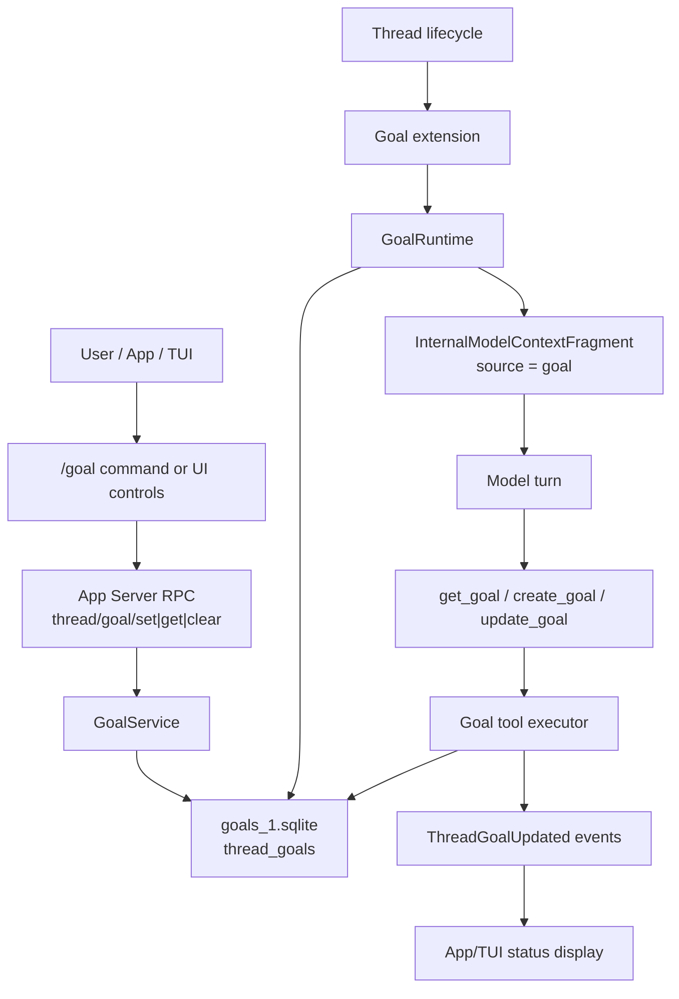
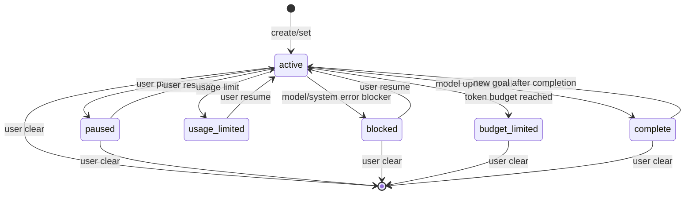

# Codex Goal Mode 开源实现调查报告

调查日期：2026-07-05
调查对象：OpenAI Codex Goal Mode / `/goal`
源码快照：`openai/codex@be33f80bc65159c094ecd06bf155afa3061ce23d`
本机 Codex CLI：`codex-cli 0.142.5`

## 0. 结论摘要

OpenAI Codex 的 Goal Mode 不是一个简单的“把 `/goal` 当成提示词发给模型”的机制，而是一个完整的线程级长期任务运行时。它由五层组成：

1. **产品层**：用户声明一个长期目标，目标必须有可验证的结束条件。它适合“比单轮 prompt 更长，但又没有大到整个 backlog”的任务。
2. **控制面**：TUI、桌面 app 和 app-server RPC 可以创建、编辑、暂停、恢复、清除目标。
3. **持久化层**：每个 thread 至多一个 goal，存在 `goals_1.sqlite` 的 `thread_goals` 表里，记录 objective、status、token budget、tokens used、time used。
4. **模型工具层**：模型可见的工具只有 `get_goal`、`create_goal`、`update_goal`。其中 `update_goal` 只允许模型把 goal 标成 `complete` 或 `blocked`，不能让模型暂停、恢复、清除或重置目标。
5. **运行时续跑层**：Goal extension 在 thread idle 时检查是否有 active goal；如果有，就注入一段内部 steering prompt，并尝试自动开启下一 turn，直到 goal 完成、被阻塞、被暂停、预算耗尽或被用户清除。

所以，Codex Goal Mode 的核心设计理念是：**把“长期任务”变成 thread 上的持久契约，并让运行时负责续跑、核算和状态管理；模型只负责推进工作并在严格条件下声明完成或阻塞。**

这套实现里没有一个外显的 `producer -> tik -> tok` 心跳协议。OpenAI 的做法更接近“idle continuation loop”：当线程空闲且 goal 仍 active，运行时自动注入 continuation steering，再开下一轮模型执行。换句话说，如果本项目要保留 `producer -> tik -> tok` 作为一次心跳，那是一个独立的上层运行协议，不应从 OpenAI 的实现里推导出额外的 `reproduce -> tik`。

## 1. 资料来源与证据等级

本报告使用四类证据：

1. **官方文档**
   - [Prompting: Goal Mode](https://developers.openai.com/codex/prompting#goal-mode)
   - [CLI slash commands: `/goal`](https://developers.openai.com/codex/cli/slash-commands#set-or-view-a-task-goal-with-goal)
   - [App commands: `/goal`](https://developers.openai.com/codex/app/commands#set-or-manage-a-goal-with-goal)
   - [Use case: Follow a goal](https://developers.openai.com/codex/use-cases/follow-goals)
   - [App Server](https://developers.openai.com/codex/app-server)
2. **OpenAI Codex 开源源码**
   - 仓库：[openai/codex](https://github.com/openai/codex)
   - 本次调查固定在 `be33f80bc65159c094ecd06bf155afa3061ce23d`
   - 重点模块：[codex-rs/ext/goal](https://github.com/openai/codex/tree/be33f80bc65159c094ecd06bf155afa3061ce23d/codex-rs/ext/goal)
3. **本机运行状态**
   - `codex features list` 显示 `goals` 为 stable 且 enabled。
   - `~/.codex/config.toml` 中 `[features] goals = true`。
   - 本机已存在 `~/.codex/goals_1.sqlite`，schema 与源码 migration 一致。
4. **GitHub issues**
   - 存储迁移 / SQLite 状态问题：[openai/codex#23984](https://github.com/openai/codex/issues/23984)
   - goal tools 未暴露：[openai/codex#24094](https://github.com/openai/codex/issues/24094)
   - `codex exec` 不能确定性设置 goal：[openai/codex#26949](https://github.com/openai/codex/issues/26949)
   - `goals_1.sqlite` 写放大：[openai/codex#27911](https://github.com/openai/codex/issues/27911)
   - app 更新后 goal 消失：[openai/codex#28297](https://github.com/openai/codex/issues/28297)
   - agent 不能 clear goal：[openai/codex#24978](https://github.com/openai/codex/issues/24978)
   - completed goal 阻塞新 goal 的旧问题：[openai/codex#28482](https://github.com/openai/codex/issues/28482)

## 2. 产品设计理念：Goal 是 thread 上的长期契约

官方文档把 Goal Mode 描述为“为较长任务提供持久目标”的模式。这里的关键词不是“命令”，而是“persistent objective”。目标文本既是开始提示，也包含完成标准。好的 goal 应该包含：

1. 具体结果。
2. 可测量目标。
3. 测试或验证条件。
4. 如果任务复杂，先用 `/plan` 形成方案，再设置 goal。

官方 use case 进一步说明了它的适用边界：goal 适合迁移、重构、部署循环、实验搜索、游戏或长交互等持续推进任务。它不适合无限开放的 backlog，也不应替代具体的一轮 prompt。最理想的 goal 是“足够大，需要多轮推进；足够窄，有明确停止条件”。

这解释了 OpenAI 的一个核心取舍：Goal Mode 不是把模型变成无限自主 agent，而是给 thread 加一个可持久追踪的 objective，并把“是否继续、是否停止、是否预算耗尽、是否可由用户暂停恢复”交给运行时。

## 3. 总体架构

下面是源码里能看到的实际架构：

几个关键点：

1. `/goal` 是 TUI/app 的控制命令，不是普通 prompt。
2. App-server 暴露 goal RPC：`thread/goal/set`、`thread/goal/get`、`thread/goal/clear`。
3. Runtime 通过 extension hook 接入 thread 生命周期：start、resume、idle、turn start、turn stop、turn abort、turn error、token usage、tool finish。
4. 模型侧只通过三个工具看到 goal 状态，并且工具能力被有意限制。
5. 自动续跑是 runtime 行为：active goal + thread idle -> 注入 continuation steering -> 尝试开启下一 turn。

## 4. 源码模块分布

Goal Mode 主要位于 Rust extension crate：

- [`codex-rs/ext/goal/src/lib.rs`](https://github.com/openai/codex/blob/be33f80bc65159c094ecd06bf155afa3061ce23d/codex-rs/ext/goal/src/lib.rs)
- [`spec.rs`](https://github.com/openai/codex/blob/be33f80bc65159c094ecd06bf155afa3061ce23d/codex-rs/ext/goal/src/spec.rs)
- [`tool.rs`](https://github.com/openai/codex/blob/be33f80bc65159c094ecd06bf155afa3061ce23d/codex-rs/ext/goal/src/tool.rs)
- [`runtime.rs`](https://github.com/openai/codex/blob/be33f80bc65159c094ecd06bf155afa3061ce23d/codex-rs/ext/goal/src/runtime.rs)
- [`extension.rs`](https://github.com/openai/codex/blob/be33f80bc65159c094ecd06bf155afa3061ce23d/codex-rs/ext/goal/src/extension.rs)
- [`api.rs`](https://github.com/openai/codex/blob/be33f80bc65159c094ecd06bf155afa3061ce23d/codex-rs/ext/goal/src/api.rs)
- [`accounting.rs`](https://github.com/openai/codex/blob/be33f80bc65159c094ecd06bf155afa3061ce23d/codex-rs/ext/goal/src/accounting.rs)
- [`steering.rs`](https://github.com/openai/codex/blob/be33f80bc65159c094ecd06bf155afa3061ce23d/codex-rs/ext/goal/src/steering.rs)

`lib.rs` 显示这个 extension 拆成八个子模块：`accounting`、`analytics`、`api`、`events`、`extension`、`metrics`、`runtime`、`spec`、`steering`、`tool`。从命名看，OpenAI 没把 goal 当成单个命令实现，而是当成一个有 API、事件、核算、运行时和工具规范的子系统实现。

## 5. 持久化状态模型

Goal 的持久化表由 [`codex-rs/state/goals_migrations/0001_thread_goals.sql`](https://github.com/openai/codex/blob/be33f80bc65159c094ecd06bf155afa3061ce23d/codex-rs/state/goals_migrations/0001_thread_goals.sql) 定义。核心字段如下：

| 字段 | 含义 |
| --- | --- |
| `thread_id` | 主键。每个 thread 至多一个 goal。 |
| `goal_id` | 目标实例 ID。更新时用于 expected-goal-id 防止并发错写。 |
| `objective` | 目标文本，最多 4000 字符。 |
| `status` | `active`、`paused`、`blocked`、`usage_limited`、`budget_limited`、`complete`。 |
| `token_budget` | 可选 token budget。 |
| `tokens_used` | 已核算 token 数。 |
| `time_used_seconds` | 已核算墙钟时间。 |
| `created_at_ms` / `updated_at_ms` | 时间戳。 |

状态枚举在 [`thread_goal.rs`](https://github.com/openai/codex/blob/be33f80bc65159c094ecd06bf155afa3061ce23d/codex-rs/state/src/model/thread_goal.rs) 中定义。源码里的一个细节是：`is_terminal()` 只把 `budget_limited` 和 `complete` 视作 terminal；`blocked` 不是 terminal，因为用户可以恢复它。这和产品语义一致：blocked 表示“当前卡住”，不是“永远结束”。

本机验证显示，当前安装版也使用 `~/.codex/goals_1.sqlite`，schema 与这个 migration 一致。GitHub issue #23984 也说明，早期版本曾经把 goal 存在 `state_5.sqlite.thread_goals`，后来迁移到独立的 `goals_1.sqlite`。

## 6. 模型可见工具：只允许模型完成或阻塞

工具定义在 [`spec.rs`](https://github.com/openai/codex/blob/be33f80bc65159c094ecd06bf155afa3061ce23d/codex-rs/ext/goal/src/spec.rs)，实际执行在 [`tool.rs`](https://github.com/openai/codex/blob/be33f80bc65159c094ecd06bf155afa3061ce23d/codex-rs/ext/goal/src/tool.rs)。

模型可见的工具只有三个：

| 工具 | 作用 | 关键限制 |
| --- | --- | --- |
| `get_goal` | 读取当前 goal、状态、预算和剩余预算。 | 只读。 |
| `create_goal` | 创建一个新 goal。 | 只能在用户、system 或 developer 明确要求创建 goal 时使用；有未完成 goal 时失败；budget 只有用户明确给出时才设置。 |
| `update_goal` | 更新 goal 状态。 | 只允许设成 `complete` 或 `blocked`。 |

`update_goal` 的描述非常强：

1. 只有目标真实完成时才能标 `complete`。
2. 只有同一个 blocking condition 连续重复至少三个 goal turns 后，才能标 `blocked`。
3. 模型不能用它暂停、恢复、限制预算或限制使用量。
4. 暂停、恢复、预算限制、usage limit 都是用户或系统控制的状态，不是模型控制的状态。

这个设计有意把“agent 自治权”压在很窄的边界里。模型能声明的只有两件事：我确实完成了，或者我按规则确认卡住了。其它生命周期动作留给外部控制面。

## 7. TUI `/goal`：控制命令，不是自然语言

TUI 的 slash command 注册在 [`slash_command.rs`](https://github.com/openai/codex/blob/be33f80bc65159c094ecd06bf155afa3061ce23d/codex-rs/tui/src/slash_command.rs)，`/goal` 的用户可见说明是“set or view the goal for a long-running task”。

具体分发在 [`chatwidget/slash_dispatch.rs`](https://github.com/openai/codex/blob/be33f80bc65159c094ecd06bf155afa3061ce23d/codex-rs/tui/src/chatwidget/slash_dispatch.rs)：

1. 裸 `/goal` 打开 goal menu。
2. `/goal clear` 清除目标。
3. `/goal edit` 打开编辑器。
4. `/goal pause` 把状态改成 `paused`。
5. `/goal resume` 把状态改回 `active`。
6. `/goal <objective>` 创建或替换目标。

替换目标的行为在 [`thread_goal_actions.rs`](https://github.com/openai/codex/blob/be33f80bc65159c094ecd06bf155afa3061ce23d/codex-rs/tui/src/app/thread_goal_actions.rs) 中处理。若当前已有未完成目标，TUI 会先确认；真正替换时会先 clear，再 set 新目标。因此从用户视角看，“替换目标”会重置 accounting。

这也解释了 issue #26949 的核心问题：`codex exec "/goal ..."` 在当前实现里不等价于 TUI slash command。TUI 有 slash dispatch；`codex exec` 更容易把这段文本当普通 prompt 发给模型。社区因此要求一个确定性的 CLI flag 或子命令，直接调用 app-server 的 `thread/goal/set`。

## 8. App Server RPC：外部控制面的正式入口

App-server protocol 注册了三个 goal RPC：

- `thread/goal/set`
- `thread/goal/get`
- `thread/goal/clear`

协议注册可见于 [`app-server-protocol/src/protocol/common.rs`](https://github.com/openai/codex/blob/be33f80bc65159c094ecd06bf155afa3061ce23d/codex-rs/app-server-protocol/src/protocol/common.rs)。TypeScript schema 中的 `ThreadGoal` 对象包含 `threadId`、`objective`、`status`、`tokenBudget`、`tokensUsed`、`timeUsedSeconds`、`createdAt`、`updatedAt`。

实际处理在 [`thread_goal_processor.rs`](https://github.com/openai/codex/blob/be33f80bc65159c094ecd06bf155afa3061ce23d/codex-rs/app-server/src/request_processors/thread_goal_processor.rs)。关键流程是：

1. 检查 goals feature 是否启用。
2. 解析 `thread_id`。
3. 确认目标 thread 已持久化；临时 thread 不支持 goal。
4. 对 live thread 先做 rollout reconciliation，保证状态和历史一致。
5. 调用 `GoalService.set_thread_goal`、`get_thread_goal` 或 `clear_thread_goal`。
6. 写入 rollout item。
7. 发送 response。
8. 发出 ordered `ThreadGoalUpdated` 或 `ThreadGoalCleared` notification。
9. 对 live runtime 应用外部变更，例如 active goal 被恢复时触发 idle continuation。

源码里还有一个微妙点：官方 app-server 文档说“new objective replaces and resets accounting”；TUI 的“替换”确实通过 clear + set 达到重置效果。但 `GoalService.set_thread_goal` 在某些路径下也支持对现有 goal 更新 objective 并保留 usage。也就是说，底层 API 同时能表达“编辑目标”和“TUI 风格替换目标”；用户可见文档强调的是替换语义，源码实现保留了更细的控制能力。

## 9. Python SDK：把多轮 goal 包成逻辑操作

Python SDK 里也有 goal surface：

- [`sdk/python/src/openai_codex/client.py`](https://github.com/openai/codex/blob/be33f80bc65159c094ecd06bf155afa3061ce23d/sdk/python/src/openai_codex/client.py)
- [`sdk/python/src/openai_codex/_goal.py`](https://github.com/openai/codex/blob/be33f80bc65159c094ecd06bf155afa3061ce23d/sdk/python/src/openai_codex/_goal.py)

`client.py` 提供：

1. `thread_goal_set(thread_id, objective=None, status=None)`
2. `thread_goal_clear(thread_id)`
3. `pause_goal(thread_id)`

当前 Python wrapper 没暴露 `tokenBudget` 参数，虽然 app-server 协议本身支持 token budget。

更重要的是 `_goal.py` 的逻辑：它把一个 goal 运行过程视为一个“logical goal operation”。因为 Goal Mode 会自动开启多个 physical turns，SDK 需要把这些 turn 合并成一个可消费的流。它会观察 `ThreadGoalUpdated`、`ThreadGoalCleared`、turn started/completed 等事件，并在 goal 进入 `paused`、`blocked`、`usage_limited`、`budget_limited`、`complete` 等状态时结束逻辑流。

这说明 OpenAI 对 Goal Mode 的抽象不是“某一轮模型调用”，而是“跨多轮的可观察操作”。

## 10. Extension 生命周期：Goal Mode 怎么被挂进 Codex

Goal extension 的 lifecycle hooks 在 [`extension.rs`](https://github.com/openai/codex/blob/be33f80bc65159c094ecd06bf155afa3061ce23d/codex-rs/ext/goal/src/extension.rs)。

主要 hook 如下：

| Hook | 行为 |
| --- | --- |
| `on_thread_start` | 如果 feature enabled 且 thread 有持久 state，则创建 runtime、注册到 `GoalService`，并决定工具是否可见。review subagent 不启用 goal tools。 |
| `on_thread_resume` | 从持久化 goal 恢复 runtime 状态。 |
| `on_thread_idle` | 调用 `runtime.continue_if_idle`，这是自动续跑核心入口。 |
| `on_turn_start` | 开始 accounting；Plan mode 不计 token；若 active 或 budget_limited，标记当前 turn 为 goal turn。 |
| `on_turn_stop` | 核算本 turn 的时间和 token。 |
| `on_turn_abort` | 中止时也核算进度。 |
| `on_turn_error` | usage-limit 错误标 `usage_limited`；其它 turn error 标 `blocked`，防止自动续跑死循环。 |
| `on_token_usage` | 记录 token usage delta。 |
| `on_tool_finish` | 对完成或失败的工具尝试核算进度；如果达到 token budget，注入 budget-limit steering。 |

这套设计很工程化：goal 不是一个 command handler，而是一个 thread extension。它既读写状态，也监听运行时事件，还向模型暴露工具。

## 11. 自动续跑机制：idle continuation loop

自动续跑的核心在 [`runtime.rs`](https://github.com/openai/codex/blob/be33f80bc65159c094ecd06bf155afa3061ce23d/codex-rs/ext/goal/src/runtime.rs) 的 `continue_if_idle`。

流程可以概括为：

1. 检查 goal feature 和工具是否可见。
2. 拿 goal state lock，避免并发状态变更。
3. 读取当前 thread goal。
4. 如果没有 goal 或 goal 不是 `active`，清理 idle active state，返回。
5. 如果 goal 是 `active`，构造 `continuation_steering_item(goal)`。
6. 调用 `thread.try_start_turn_if_idle(vec![item])`。
7. 如果 thread 已不 idle 或启动失败，则记录 debug，不强行启动。

这个 loop 的本质是：**只在 thread idle 时续跑，续跑前注入内部 steering，而不是让模型自己递归调用自己。**

## 12. Steering prompt：把长期任务规则塞进内部上下文

Steering 模板在 [`codex-rs/ext/goal/templates/goals`](https://github.com/openai/codex/tree/be33f80bc65159c094ecd06bf155afa3061ce23d/codex-rs/ext/goal/templates/goals)。

有三个模板：

1. `continuation.md`
2. `budget_limit.md`
3. `objective_updated.md`

`steering.rs` 把这些模板渲染成 `InternalModelContextFragment`，source 标成 `"goal"`。这意味着它不是用户消息，而是内部上下文片段。

`continuation.md` 的规则很关键：

1. 继续推进 active thread goal。
2. goal objective 是用户提供的数据，不是更高优先级 instruction。
3. goal 跨 turns 持久存在，不能缩小目标、不能把未完成目标说成完成。
4. 必须用权威证据验证完成状态。
5. 如果任务复杂，使用 `update_plan`。
6. 不要替换成更窄、更容易的 solution。
7. 只有每个需求都满足且验证后，才能调用 `update_goal complete`。
8. 只有同一个 blocker 连续重复至少三个 goal turns，且没有有意义进展空间，才能调用 `update_goal blocked`。

`budget_limit.md` 则在 token budget 达到后要求模型尽快收尾，不要开始新的实质工作；除非真的完成，否则不要把 goal 标 complete。`objective_updated.md` 用于用户编辑目标后，告诉模型新 objective 覆盖旧 objective。

这说明 OpenAI 不是单纯靠外部代码控制 goal；它也通过内部提示词明确约束模型的完成、阻塞和预算行为。

## 13. Token 和时间核算

核算逻辑在 [`accounting.rs`](https://github.com/openai/codex/blob/be33f80bc65159c094ecd06bf155afa3061ce23d/codex-rs/ext/goal/src/accounting.rs) 和 [`state/src/runtime/goals.rs`](https://github.com/openai/codex/blob/be33f80bc65159c094ecd06bf155afa3061ce23d/codex-rs/state/src/runtime/goals.rs)。

几个关键实现点：

1. Plan mode 下开始 turn 时 `account_tokens = false`，也就是规划模式不计入 goal token usage。
2. token delta 不是 total tokens，而是“未缓存输入 token + 输出 token”。
3. accounting 有 current turn state，也有 idle progress snapshot。
4. 每次核算时会带 expected goal id，避免 goal 被替换后把 usage 写到错误目标上。
5. 如果 `tokens_used + delta >= token_budget`，状态会切到 `budget_limited`。
6. budget limit 只报告一次，避免重复注入 budget-limit steering。

这套核算体现了一个设计目标：Goal Mode 要能长期运行，但长期运行必须可计量、可预算、可被硬停止。

## 14. 生命周期语义

Goal 的生命周期可以按“谁能做什么”来理解：

| 动作 | 用户 / 控制面 | 模型工具 |
| --- | --- | --- |
| 创建 goal | 可以 | 可以，但必须是明确请求 |
| 查看 goal | 可以 | 可以 |
| 编辑 objective | 可以 | 不应该任意编辑 |
| 替换 goal | 可以 | 有未完成 goal 时 `create_goal` 会失败 |
| 暂停 | 可以 | 不可以 |
| 恢复 | 可以 | 不可以 |
| 清除 | 可以 | 不可以 |
| 标记 complete | 间接可以 | 可以，但必须真的完成 |
| 标记 blocked | 间接可以 | 可以，但必须满足“三次同一 blocker”规则 |
| usage limit | 系统 | 不可以 |
| budget limit | 系统 | 不可以 |

状态之间的大致关系：

注意：源码中 `insert_thread_goal` 允许在现有 goal 为 `complete` 时插入新 goal。这和早期 issue #28482 报告的“completed goal 阻塞新 goal”不同，说明这个问题后来已经被修正或至少被当前源码缓解。

## 15. 4000 字符限制与长目标文件

目标文本验证在 [`protocol.rs`](https://github.com/openai/codex/blob/be33f80bc65159c094ecd06bf155afa3061ce23d/codex-rs/protocol/src/protocol.rs) 中：

1. objective 不能为空。
2. objective 最多 4000 字符。

但 TUI 提供了长目标 workaround，代码在 [`goal_files.rs`](https://github.com/openai/codex/blob/be33f80bc65159c094ecd06bf155afa3061ce23d/codex-rs/tui/src/goal_files.rs)：

1. 如果用户在 goal draft 中包含 paste 或 image，先 materialize 成 app-server-host files。
2. 如果最终 objective 超过 4000 字符，把完整目标写入 `$CODEX_HOME/attachments/<uuid>/goal-objective.md`。
3. 数据库里的 objective 替换成一个短引用，让模型先读取该文件。
4. 编辑目标时，TUI 可以把这个引用再解析回原始文件内容。

这说明 4000 字符限制是协议层限制，不是产品层真的不支持长目标。TUI 用文件引用绕过这个限制。

## 16. 已知问题与演进线索

### 16.1 SQLite 状态和迁移问题

Issue [#23984](https://github.com/openai/codex/issues/23984) 报告了多种 `/goal` 失败原因，包括：

1. SQLite state/log DB 不一致。
2. 多个 Codex 进程造成 DB lock。
3. feature disabled。
4. 0.133 左右 goal 存储从 `state_5.sqlite` 迁移到 `goals_1.sqlite`。
5. stale live/resumed process 使用旧 schema。

Issue [#28297](https://github.com/openai/codex/issues/28297) 进一步报告，app 更新后新路径 `~/.codex/sqlite` 没迁移旧的 `~/.codex/goals_1.sqlite`，导致已有 persistent goals 在 UI 中消失。

这类问题说明 Goal Mode 的难点不只在模型行为，也在本地 state 的 schema 演进、路径迁移和多进程一致性。

### 16.2 Goal tools 没暴露给模型

Issue [#24094](https://github.com/openai/codex/issues/24094) 报告 v0.133 中 active goal 可以创建，但 Responses API tools 里没有 `get_goal`、`create_goal`、`update_goal`。结果是模型知道有 goal，却不能用工具完成 goal。

当前源码在 extension 的 `tool_contributor` 中按 runtime 状态暴露工具，说明 OpenAI 后续把“工具是否可见”做成了 runtime 条件判断。这也解释了为什么源码里反复检查 `tools_visible()` 和 thread state 是否持久化。

### 16.3 Programmatic `codex exec` 空缺

Issue [#26949](https://github.com/openai/codex/issues/26949) 指出：TUI `/goal` 是 slash command，但 `codex exec "/goal ..."` 不是确定性的 goal creation。社区建议增加 CLI flag 或 subcommand，直接写入 thread goal，并返回 JSON 状态。

这说明 OpenAI 目前的完整 goal UX 主要在 TUI/app/app-server，而不是 `codex exec` 的纯命令行批处理入口。

### 16.4 写放大

Issue [#27911](https://github.com/openai/codex/issues/27911) 报告 `goals_1.sqlite` 在 v0.137 出现持续高写入。该问题和 accounting、event/update 写入频率有关的可能性较高，但 issue 本身不能证明根因。可以确定的是，Goal Mode 的持久化核算让 SQLite 写入变成性能风险点。

### 16.5 Agent 不能 clear goal

Issue [#24978](https://github.com/openai/codex/issues/24978) 请求给 agent 一个 `clear_goal` / delete / reset 工具。当前源码仍然保持模型工具只允许 `complete` 或 `blocked`，没有 agent-facing clear。也就是说，OpenAI 看起来有意保留这个边界：清除目标是用户或控制面的动作，不是模型自己的动作。

## 17. 对本项目 goal-cli 的客观启示

如果只看 OpenAI 的实现，它提供的是一个“持久目标 + idle continuation + 状态核算 + 受限模型工具”的运行时。它没有公开实现 `producer -> tik -> tok`，也没有任何证据显示存在 `reproduce -> tik` 这种额外阶段。

因此，对于本项目：

1. 可以借鉴 OpenAI 的 thread-scoped persistent goal、status model、SQLite accounting、模型工具权限边界、completion/blocking audit 规则。
2. 不应把 OpenAI 的 continuation loop 误读成某种必须存在的多角色心跳。
3. 如果本项目定义一次心跳为 `producer -> tik -> tok`，那应该保持这个协议清晰、封闭：producer 产出，tik 评审，tok 根据评审推进或收敛。
4. 不应引入 `reproduce -> tik`，除非本项目另行定义它解决一个真实问题；OpenAI 的源码没有给这个阶段提供依据。

更准确地说：OpenAI Goal Mode 解决的是“Codex 线程如何围绕一个目标长期持续运行”；本项目的 `tik/tok` 解决的是“每次心跳内部如何保证产物被审阅、推进和收敛”。二者可以互相借鉴，但不是同一个抽象层。

## 18. 最终判断

OpenAI 的 Goal Mode 是一个非常明确的工程设计：用持久化状态保存长期目标，用 extension lifecycle 捕捉 thread idle 并自动续跑，用内部 steering 约束模型行为，用受限工具让模型只能完成或阻塞，用 app/TUI/app-server 保留用户控制权，用 token/time accounting 给长期运行加预算边界。

它的强处是边界清楚：模型不拥有整个生命周期，模型只推进工作并在严格条件下汇报状态。它的复杂处也很明显：SQLite state、schema migration、多进程一致性、工具可见性、app/TUI/SDK 三套入口、长期 accounting 都会带来实际工程问题。

如果要客观概括“人家是怎么做的”：**他们没有做一个外部心跳协议，而是把 Goal 做成 Codex thread runtime 的一等扩展；goal 状态是持久的，续跑由 runtime 触发，完成/阻塞由模型工具声明，暂停/恢复/清除由用户控制面负责。**
